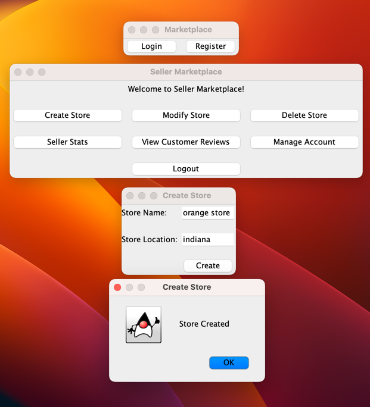
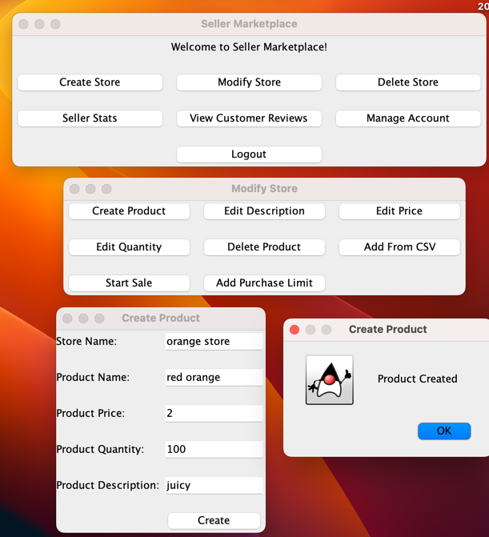
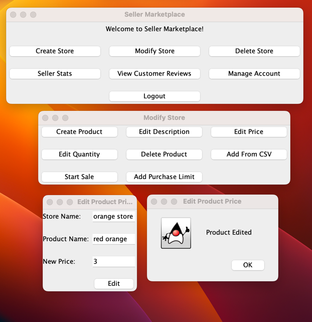
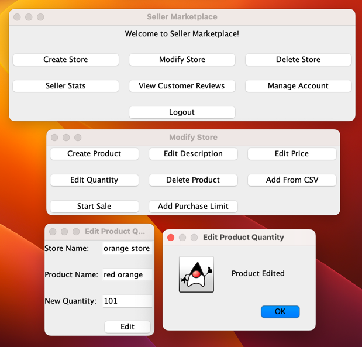
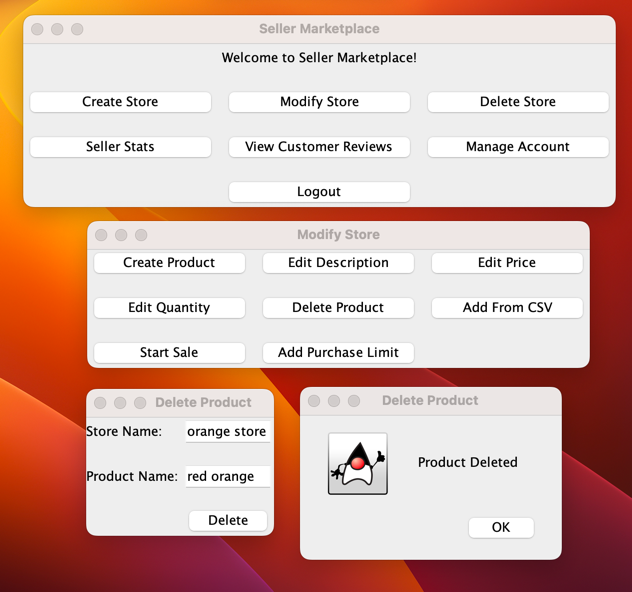

**USER TEST CASES**

Test 1: User registration

Steps:

1. User launches application.
2. User selects the "Register" button.
3. User selects the "Email" textbox.
4. User enters email via the keyboard.
5. User selects the "Username" textbox.
6. User enters username via the keyboard.
7. User selects the "Password" textbox.
8. User selects the role.
9. User selects the "Register" button.

Expected result: Application creates the user's account and loads their homepage automatically.

Test Status: Passed.

Test 2: User log in

Steps:

1. User launches application.
2. User selects the "Log in" button.
3. User selects the username textbox.
4. User enters username via the keyboard.
5. User selects the password textbox.
6. User enters the password via the keyboard.

Expected result: Application verifies the user's email/username and password and loads their homepage automatically.

Test Status: Passed.

Test 3: User logout

Steps:

1. After logging in (User Test Cases - Test 2)
2. User selects the "Logout" button.

Expected result: Application logs out the user and loads the login/register page automatically.

Test Status: Passed.

Test 4: User Change Username

Steps:

1. After logging in (User Test Cases - Test 2)
2. User selects the "Manage Account" button.
3. User selects the "Change Username" button.
4. User selects the "New Username" textbox.
5. User enters the new username via the keyboard.
6. User selects the "Change" button.
7. User sees the "Username Changed" page.
8. User selects the "OK" button.
9. User selects the red circle to exit the "Change Username" page.
10. User selects the red circle to exit the "Manage Account" page.
11. User selects the "Logout" button.
12. User logs in with the new username. (User Test Cases - Test 2)

Expected result: Application logs in the user and loads their homepage automatically.

Test Status: Passed.

Test 5: User Change Password

Steps:

1. After logging in (User Test Cases - Test 2)
2. User selects the "Manage Account" button.
3. User selects the "Change Password" button.
4. User selects the "Old Password" textbox.
5. User enters the old password via the keyboard.
6. User selects the "New Password" textbox.
7. User enters the new password via the keyboard.
8. User selects the "Change" button.
9. User sees the "Password Changed" page.
10. User selects the "OK" button.
11. User selects the red circle to exit the "Change Password" page.
12. User selects the red circle to exit the "Manage Account" page.
13. User selects the "Logout" button.
14. User logs in with the new password. (User Test Cases - Test 2)

Expected result: Application logs in the user and loads their homepage automatically.

Test Status: Passed.

Test 6: User Change Role

Steps:

1. After logging in (User Test Cases - Test 2)
2. User selects the "Manage Account" button.
3. User selects the "Change Role" button.
4. User selects the "Password" textbox.
5. User enters the password via the keyboard.
6. User selects the "Change To Buyer"/"Change To Seller" button depending on which role they are.
7. User sees the "Role Changed" page.
8. User selects the "OK" button.
9. User sees the login/register page automatically.
10. User logs in (User Test Cases - Test 2)

Expected result: Application logs in the user and loads their new role homepage automatically.

Test Status: Failed for changing role from buyer to seller.

Test 7: User Delete Account

Steps:

1. After logging in (User Test Cases - Test 2)
2. User selects the "Manage Account" button.
3. User selects the "Delete Account" button.
4. User selects the "Password" textbox.
5. User enters the password via the keyboard.
6. User sees the "Account Deleted" page. 
7. User selects the "OK" button.
8. User sees the login/register page automatically.
9. User tries to log in with the deleted account username and password. (User Test Cases - Test 2)

Expected result: Application loads the "Login Failed" page because the account has been deleted.

Test Status: Passed.
**END OF USER TEST CASES**

**SELLER MARKETPLACE TEST CASES**

Test 1: Seller Create Store

Steps:

1. After logging in (User Test Cases - Test 2)
2. Seller selects the "Create Store" button.
3. Seller selects the "Store Name" textbox.
4. Seller enters the store name via the keyboard.
5. Seller selects the "Store Location" textbox.
6. Seller enters the store location via the keyboard.
7. Seller selects the "Create" button.
8. Seller sees the "Store Created" page. <- expected result.
9. Seller selects the "OK" button.
10. Seller selects the red circle to return to the home page.

Expected result: Seller sees the "Store Created" page.

Test Status: Passed

**SELLER MODIFY STORE TEST CASES**

Steps before performing the following test cases:

1. After logging in (User Test Cases - Test 2)
2. Seller selects the "Modify Store" button.

Test 1: Seller Create Product

1. Seller selects the "Create Store" button.
2. Seller selects the "Store Name" textbox.
3. Seller enters the store name via the keyboard.
4. Seller selects the "Product Name" textbox.
5. Seller enters the product name via the keyboard.
6. Seller selects the "Product Price" textbox.
7. Seller enters the product price via the keyboard.
8. Seller selects the "Product Quantity" textbox.
9. Seller enters the product quantity via the keyboard.
10. Seller selects the "Product Description" textbox.
11. Seller enters the product description via the keyboard.
12. Seller selects the "Create" button.
13. Seller see the "Product Created" page. <- expected result
14. Seller selects the "OK" button.
15. Seller selects the red circle to return to the "Modify Store" homepage.

Expected result: Application loads the "Product Created" page.

Test Status: Passed.

Test 2: Seller Edit Description

Steps:

1. Seller selects the "Edit Description" button.
2. Seller selects the "Store Name" textbox.
3. Seller enters the store name via the keyboard.
4. Seller selects the "Product Name" textbox.
5. Seller enters the product name via the keyboard.
6. Seller selects the "New Description" textbox.
7. Seller enters the new description via the keyboard.
8. Seller selects the "Edit" button.
9. Seller sees the "Product Edited" page. <- expected result
10. Seller selects the "OK" button.
11. Seller selects the red circle to return to the "Modify Store" homepage.

Expected result: Application loads the "Product Edited" page.

Test Status: Failed.

Test 3: Seller Edit Price

Steps:

1. Seller selects the "Edit Price" button.
2. Seller selects the "Store Name" textbox.
3. Seller enters the store name via the keyboard.
4. Seller selects the "Product Name" textbox.
5. Seller enters the product name via the keyboard.
6. Seller selects the "New Price" textbox.
7. Seller enters the new price via the keyboard.
8. Seller selects the "Edit" button.
9. Seller sees the "Product Edited" page.
10. Seller selects the "OK" button.
11. Seller selects the red circle to return to the "Modify Store" homepage.

Expected result: Application loads the "Product Edited" page.

Test Status: Passed.

Test 4: Seller Edit Quantity

Steps:

1. Seller selects the "Edit Quantity" button.
2. Seller selects the "Store Name" textbox.
3. Seller enters the store name via the keyboard.
4. Seller selects the "Product Name" textbox.
5. Seller enters the product name via the keyboard.
6. Seller selects the "New Quantity" textbox.
7. Seller enters the new quantity via the keyboard.
8. Seller selects the "Edit" button.
9. Seller sees the "Product Edited" page. <- expected result
10. Seller selects the "OK" button.
11. Seller selects the red circle to return to the "Modify Store" homepage.

Expected result: Application loads the "Product Edited" page.

Test Status: Passed.

Test 5: Seller Delete Product

Steps:

1. Seller selects the "Delete Product" button.
2. Seller selects the "Store Name" textbox.
3. Seller enters the store name via the keyboard.
4. Seller selects the "Product Name" textbox.
5. Seller enters the product name via the keyboard.
6. Seller selects the "Delete" button.
7. Seller sees the "Product Deleted" page. <- expected result
8. Seller selects the "OK" button.
9. Seller selects the red circle to return to the "Modify Store" homepage.

Expected result: Application loads the "Product Edited" page.

Test Status: Passed.

Test 6: Seller Add From CSV

1. Seller selects the "Add From CSV" button.
2. Seller selects the "Store Name" textbox.
3. Seller enters the store name via the keyboard.
4. Seller selects the "CSV Path" textbox.
5. Seller enters the csv name via the keyboard.
6. Seller selects the "Add Products" button.
7. Seller selects the red circle to return to the "Modify Store" homepage.

Expected result: Buyers can purchase products added from the csv file (Buyer Shopping Cart Test Cases 1 & 5).

Test Status: Failed.

**END OF SELLER MODIFY STORE TEST CASES**
**END OF SELLER MARKETPLACE TEST CASES**

**BUYER MARKETPLACE TEST CASES**

Test 1: Buyer Search for a Store

Steps:

1. After logging in (User Test Cases - Test 2)
2. Buyer selects the "Search for a Store" button.
3. Buyer selects the "Enter Store Name" textbox.
4. Buyer enters the store name via the keyboard.
5. Buyer selects the "OK" button.
6. Buyer sees a page with product names in the store. <- expected result
7. Repeat steps 2-6 to search for another store.
8. Buyer selects the red circle to return to the home page.

Expected result: Application loads the page with product names in the searched store.

Test Status: Passed.

Test 2: Buyer Search for a Product

Steps:

1. After logging in (User Test Cases - Test 2)
2. Buyer selects the "Search for a Product" button.
3. Buyer selects the "Enter Product Name" textbox.
4. Buyer enters the product name via the keyboard.
5. Buyer selects the "OK" button.
6. Buyer sees a page with the product details <- expected result
7. Repeat steps 2-6 to search for another product.
8. Buyer selects the red circle to return to the home page.

Expected result: Application loads the page with product details of the searched product name.

Test Status: Passed.

Test 3: Buyer Search for a Product by Description

Steps:

1. After logging in (User Test Cases - Test 2)
2. Buyer selects the "Search for a Product by Description" button.
3. Buyer selects the "Enter Description" textbox.
4. Buyer enters the description via the keyboard.
5. Buyer selects the "OK" button.
6. Buyer sees a page with the product details <- expected result
7. Repeat steps 2-6 to search for another product.
8. Buyer selects the red circle to return to the home page.

Expected result: Application loads the page with product details of the searched description.

Test Status: Passed.

Test 4: Buyer View all Products

Steps:

1. After logging in (User Test Cases - Test 2)
2. Buyer selects the "View all Products" button.
3. Buyer sees a page with all the products available in the marketplace and their product details <- expected result
4. Buyer selects the red circle to return to the home page.

Expected result: Application loads the page with all the products available in the marketplace and their product
details.

Test Status: Passed.

Test 5: Buyer Sort Products by Cheapest

Steps:

1. After logging in (User Test Cases - Test 2)
2. Buyer selects the "Sort Products by Cheapest" button.
3. Buyer sees a page with all the products available in the marketplace and their product details sorted by cheapest <-
   expected result
4. Buyer selects the red circle to return to the home page.

Expected result: Application loads the page with all the products available in the marketplace and their product details
sorted by cheapest.

Test Status: Passed.

Test 6: Buyer Sort Products by Most Expensive

Steps:

1. After logging in (User Test Cases - Test 2)
2. Buyer selects the "Sort Products by Most Expensive" button.
3. Buyer sees a page with all the products available in the marketplace and their product details sorted by most
   expensive <- expected result
4. Buyer selects the red circle to return to the home page.

Expected result: Application loads the page with all the products available in the marketplace and their product details
sorted by most expensive.

Test Status: Passed.

Test 7: Buyer Sort Products by Availability -- lowest quantity

Steps:

1. After logging in (User Test Cases - Test 2)
2. Buyer selects the "Sort Products by Availability" button.
3. Buyer selects the "OK" button.
4. Buyer sees a page with all the products available in the marketplace and their product details sorted by lowest
   quantity <- expected result
5. Buyer selects the red circle to return to the home page.

Expected result: Application loads the page with all the products available in the marketplace and their product details
sorted by lowest quantity.

Test Status: Passed.

Test 8: Buyer Sort Products by Availability -- highest quantity

Steps:

1. After logging in (User Test Cases - Test 2)
2. Buyer selects the "Sort Products by Availability" button.
3. Buyer selects "Sort by Highest Quantity" in the dropdown menu.
4. Buyer selects the "OK" button.
5. Buyer sees a page with all the products available in the marketplace and their product details sorted by highest
   quantity <- expected result
6. Buyer selects the red circle to return to the home page.

Expected result: Application loads the page with all the products available in the marketplace and their product details
sorted by highest quantity.

Test Status: Passed.

**BUYER SHOPPING CART TEST CASES**

Steps before performing the following test cases:

1. After logging in (User Test Cases - Test 2)
2. Buyer selects the "Shopping Cart" button.

Test 1: Buyer Add Products to Cart

Steps:

1. Buyer selects "Add Products to Cart" button.
2. Buyer selects the "Enter Store Name" textbox.
3. Buyer enters the store name via the keyboard.
4. Buyer selects the "Enter Product Name" textbox.
5. Buyer enters the product name via the keyboard.
6. Buyer selects the "Enter Quantity" textbox.
7. Buyer enters the product quantity to purchase via the keyboard.
8. Buyer selects the "Add" button.
9. Buyer sees the "Product Added to Cart!" page. <- expected result
10. Buyer selects the "OK" button.
11. Buyer selects the red circle until they return to the shopping cart home page.
12. Buyer views shopping cart and sees the added product (Buyer Shopping Cart Test Cast 4: Buyer View Shopping Cart)

Expected result: Buyer sees the "Product Added to Cart!" page and the shopping cart is updated.

Test Status: Passed.

Test 2: Buyer Modify Quantity in Shopping Cart

Steps:

1. Buyer selects "Modify Quantity in Shopping Cart" button.
2. Buyer selects the "Enter Store Name" textbox.
3. Buyer enters the store name via the keyboard.
4. Buyer selects the "Enter Product Name" textbox.
5. Buyer enters the product name via the keyboard.
6. Buyer selects the "Enter Quantity" textbox.
7. Buyer enters the product quantity to modify (if the quantity is negative, said quantity of product is removed) via
   the keyboard.
8. Buyer selects the "CHANGE" button.
9. Buyer sees the (check if fixed) "Added Product Quantity" page OR the "Product Removed from Cart" page. <- expected
   result.
10. Buyer selects the "OK" button.
11. Buyer selects the red circle until they return to the shopping cart home page.
12. Buyer views shopping cart and sees the modified product quantity (Buyer Shopping Cart Test Case 4: Buyer View
    Shopping Cart).

Expected result: Buyer sees the
"Added Product Quantity" page OR the "Product Removed from Cart" page and the number of products in view shopping cart
has increased/ decreased as expected.

Test Status: Passed.

Test 3: Buyer Remove Products From Cart

Steps:

1. Buyer selects "Remove Products From Cart" button.
2. Buyer selects the "Enter Store Name" textbox.
3. Buyer enters the store name via the keyboard.
4. Buyer selects the "Enter Product Name" textbox.
5. Buyer enters the product name via the keyboard.
6. Buyer selects the "Enter Quantity" textbox.
7. Buyer enters the product quantity to remove via the keyboard.
8. Buyer selects the "REMOVE" button.
9. Buyer sees the "Product Removed from Cart!" page. <- expected result.
10. Buyer selects the "OK" button.
11. Buyer selects the red circle until they return to the shopping cart home page.
12. Buyer views shopping cart and sees the product quantity has decreased by the number of products removed (Buyer
    Shopping Cart Test Case 4: Buyer View Shopping Cart).

Expected result: Buyer sees the "Product Removed from Cart!" page and number of products have been removed as expected.

Test Status: Passed.

Test 4: Buyer View Shopping Cart

Steps:

1. Buyer selects "View Shopping Cart" button.
2. Buyer sees the shopping cart with all the products ready for checkout. <- expected result
3. Buyer selects the red circle to return to the shopping cart homepage.

Expected result: Buyer sees the shopping cart with all the products ready for checkout.

Test Status: Passed.

Test 5: Buyer CHECKOUT

Steps:

1. Buyer selects "CHECKOUT" button.
2. Buyer sees the "Purchased Successfully" page.
3. Buyer selects the "OK" button.
4. Buyer selects the red circle to return to the shopping cart homepage.

Expected result: Buyer sees the "Purchased Successfully" page and when they View Shopping Cart (Buyer Shopping Cart Test
Case 4: Buyer View Shopping Cart), it's empty. Product quantity has also decreased by the purchased amount which can be
seen by Test 4: Buyer View all Products.

Test Status: Passed.

**END OF BUYER SHOPPING CART TEST CASES**

Test 9: Buyer Export Purchase History as file

Steps:

1. After logging in (User Test Cases - Test 2)
2. Buyer selects the "Export Purchase History as file" button.
3. Buyer selects the "Enter Filename to be Exported to" textbox.
4. Buyer enters the filename via the keyboard.
5. Buyer selects the "OK" button.
6. Buyer sees "Purchase History Exported Successfully!" page.
7. Buyer selects the "OK" button.

Expected result: The file with the purchase history data is created.

Test Status: Passed.

Test 10: Buyer Leave Review

Steps:

1. After logging in (User Test Cases - Test 2)
2. Buyer selects the "Leave Review" button.
3. Buyer selects the "Product Name" textbox.
4. Buyer enters the product name via the keyboard.
5. Buyer selects the "Store Name" textbox.
6. Buyer enters the store name via the keyboard.
7. Buyer selects the rating using the "Rating" dropdown menu.
8. Buyer selects the "Review Description" textbox.
9. Buyer enters the review description via the keyboard.
10. Buyer selects the "OK" button.
11. Buyer sees "Review Left Successfully" page. <- expected result
12. Buyer selects the "OK" button.
13. Buyer selects the red circle to return to the home page.

Expected result: Application loads the "Review Left Successfully" page and the review appears when the buyer views
customer reviews (Buyer Marketplace Test Cases - Test 11)

Test Status: Passed.

Test 11: Buyer View Customer Reviews

Steps:

1. After logging in (User Test Cases - Test 2)
2. Buyer selects the "Enter Store Name" textbox.
3. Buyer enters the store name via the keyboard.
4. Buyer selects the "Enter Product Name (Leave Empty To View All)" textbox.
5. Buyer enters the product name via the keyboard or leaves the textbox empty.
6. Buyer selects the "View" button.
7. Buyer sees a page with all the customer reviews for a product OR a page with all the customer reviews for all
   products with reviews (depending on what option they previously selected for "Enter Product Name (Leave Empty To View
   All)"). <- expected result
8. Buyer selects the red circle to return to the "View Customer Reviews" page.
9. Buyer selects the red circle to return to the homepage.

Expected result: Application loads the page with all the customer reviews for a product OR a page with all the customer
reviews for all products with reviews (depending on what option they previously selected for "Enter Product Name (Leave
Empty To View All)").

Test Status: Passed.

**END OF BUYER MARKETPLACE TEST CASES**

**CONCURRENCY & NETWORK IO TEST CASES**

// concurrency
2 buyers and buy from same seller, same store, same product make sure quantity decreases by right number
2 sellers and the customer view products updates correctly